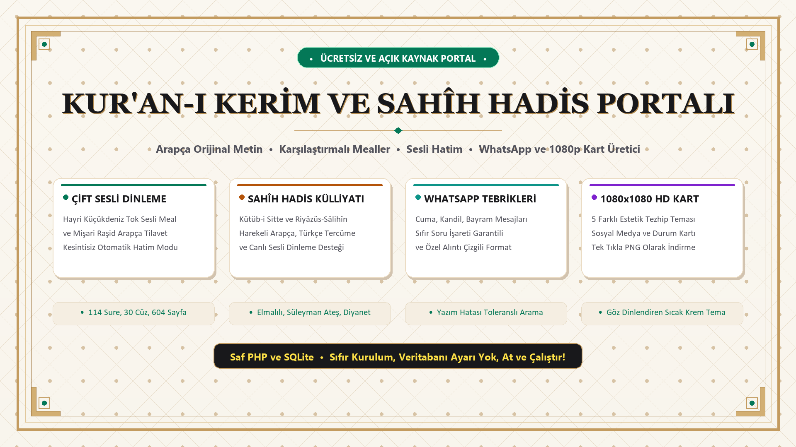

# 📖 Kur'an-ı Kerim ve Sahîh Hadis Portalı

<p align="center">
  
</p>

<p align="center">
  <a href="https://github.com/muqo16"></a>
  
  
  
  
</p>

---

## 🌟 Proje Hakkında

**Kur'an-ı Kerim ve Sahîh Hadis Portalı**, İslam dininin yüce mesajını modern, hızlı, zarif ve gözü dinlendiren bir arayüzle sunmak amacıyla geliştirilmiş **%100 Açık Kaynak ve Ücretsiz** bir web uygulamasıdır.

Hiçbir harici ağır framework veya karmaşık SQL kurulumu gerektirmez; tek bir PHP dosyası ve optimize edilmiş yerel SQLite veritabanı ile paylaşımlı en mütevazı hostingde dahi milisaniyeler içinde yüksek hızda çalışır.

---

## ✨ Öne Çıkan Özellikler

### 1. 📖 Tam Kur'an-ı Kerim Külliyatı & Karşılaştırmalı Mealler
* **6.236 Ayet, 114 Sure, 30 Cüz ve 604 Mushaf Sayfası:** Eksiksiz ve tam veritabanı.
* **Harekeli Uthmani Arapça Metin:** Özel *Amiri Quran* hattı ile yüksek çözünürlüklü okunabilir tipografi.
* **Açıklamalı Türkçe Meali:** Varsayılan akıcı ve anlaşılır meal.
* **Karşılaştırmalı Mealler Akordeonu:** Tek tıkla *Elmalılı Hamdi Yazır*, *Süleyman Ateş* ve *Diyanet İşleri Başkanlığı* mealleri yan yana.
* **Türkçe Latin Harfli Okunuş (Transliterasyon):** Üst menüden anında açılıp kapatılabilir.
* **Dinamik Arapça Yazı Boyutu:** 20px - 48px aralığında tek tıkla ölçekleme.

### 2. 🎙️ Çift Sesli Dinleme & Kesintisiz Otomatik Hatim (Dual Audio Engine)
* **Tok Sesli Türkçe Meal Dinleme:** Usta seslendirme sanatçısı **Hayri Küçükdeniz**'in vakur ve etkileyici ses kaydı.
* **Arapça Orijinal Tilavet:** Dünyaca ünlü kâri **Şeyh Mişari Raşid el-Afasi** tilaveti.
* **Otomatik Hatim Modu:** Ayet bittiğinde sonraki ayete otomatik geçer, okunan ayeti zümrüt ışığıyla vurgular ve sayfayı akıcı biçimde kaydırır.
* **Sabit Alt Oynatıcı:** Hız kontrolü (1x / 1.25x / 1.5x), ses seviyesi ve ayetler arası hızlı geçiş.

### 3. 📜 Sahih Hadisler Külliyatı (Kütüb-i Sitte & Riyâzüs-Sâlihîn)
* Buhârî, Müslim, Ebû Dâvûd, Tirmizî, Nesâî, İbn Mâce ve İmam Nevevî'nin Riyâzüs-Sâlihîn eserinden derlenen Sahih Hadis-i Şerifler.
* Harekeli Arapça metin, Türkçe tercüme, ravi bilgisi, kaynak referansı ve hayatımıza rehber olacak ahlaki hikmet izahı.
* **Canlı Seslendirme:** Web Speech API ile hadisleri tok bir Türkçe ses tonuyla dinleme.

### 4. 💬 WhatsApp Cuma & Özel Gün Paylaşımı (Sıfır Soru İşareti Garantili)
* Cuma, Ramazan, Kadir Gecesi, Bayramlar, Kandiller ve Şifa duaları için hazır şablonlar.
* **Evrensel Karakter Filtreleyici:** Windows ve mobil cihazlarda harflerin soru işaretine (`?` / ``) dönüşmesini önleyen `cleanArabicForUniversal` algoritması.
* WhatsApp'ın resmi dikey alıntı formatı (`>`) ile şık kart görünümünde tek tıkla paylaşım.

### 5. 🎨 1080x1080 HD Sosyal Medya Görsel Kart Üreticisi (HTML5 Canvas)
* Instagram, WhatsApp Durum, Twitter ve Facebook için 1080x1080 piksel HD kare görsel üretme.
* **5 Farklı Tezhip Teması:** Sıcak Ferah Krem, Zümrüt & Altın Yaldız, Gece & Hilal Lacivert, Gül Kurusu Bordo, Selçuklu Turkuazı.
* İsme özel imza (*"Tebrik Eden: ..."*) ekleme ve yüksek kaliteli PNG olarak anında indirme.

### 6. 🔍 Akıllı Arama & FTS5 Motoru (Yazım Hatası Toleranslı)
* SQLite FTS5 tam metin indeksleme ile anında arama.
* Türkçe kök, şapkalı harf ve yazım yanlışı toleransı (*"healal"* yazılsa dahi *"helal"* ayetlerini listeler).
* Arama sonuçlarını tek tıkla `.txt` dosyası olarak indirme veya PDF/Yazıcıya gönderme.

### 7. 🕌 81 İl Namaz Vakitleri & Vakit Girişinde Hadis Bildirimi
* **81 İlin Tamamı:** Adana'dan Zonguldak'a tüm iller için Diyanet İşleri Başkanlığı hesaplama metodu (`method=13`).
* **Canlı Geri Sayım & Aktif Vakit Işığı:** Bir sonraki vakte kalan süreyi saniyesi saniyesine canlı sayar, mevcut vakit kartını vurgular.
* **Vakit Girdiğinde Hadis-i Şerif Bildirimi:** Vakit girdiğinde Peygamber Efendimiz'in (s.a.v.) o vakte özel sahih hadis-i şerifi ile hem görsel toast hem de tarayıcı masaüstü bildirimi gönderir.
* **Hicri Takvim & Gece/Teheccüd Saatleri:** Miladi ve Hicri tarih bilgisi.

### 8. 🎓 İnteraktif Kur'an Öğreniyorum (Elif-Bâ & Tecvid Akademisi)
* **A'dan Z'ye 8 Aşamalı Müfredat:** Çocuklardan yetişkinlere herkesin kolayca Kur'an okumayı öğrenmesi için tasarlandı.
* **28 Harf & Mahreç Kartları:** İnce, kalın ve peltek harf ayrımları, çocuklar için akılda kalıcı görsel benzetmeler ve tek tıkla sesli telaffuz.
* **Harflerin Başta-Ortada-Sonda Halleri & Birleşmeyen 6 Harf:** İnteraktif kelime birleştirme örnekleri.
* **Harekeler (Üstün, Esre, Ötre), Cezm & Şedde, Tenvinler, Uzatma (Med):** Sesli dinleme tahtası.
* **Kolay Tecvid Rehberi:** Kalkale, İhfa, İzhar, İdgam, İklab ve Lafzatullah kuralları ve Kur'an'dan sesli örnekler.
* **İnteraktif Mini Test & İlk Sureler:** Puanlı harf/kural tanıma testi, doğru/yanlış ses efektleri ve Fâtiha, İhlâs, Felak, Nâs sureleri okuma alanı.

### 9. 🏛️ İslam Tarihi Fihristi & Kronolojisi
* Peygamberler Tarihi, Mekke & Medine Dönemi, Gazveler, Dört Halife ve Mushaf Tarihini kapsayan 34 kapsamlı tarihi hadise.
* Her hadisenin Kur'an'daki ilgili ayetleri, doğrudan o sureyi açan butonlar, manevi hikmetler, sesli okuma ve WhatsApp paylaşımı.

### 10. 👁️ Göz Dinlendiren Sıcak Krem & Koyu Tema
* Gözü yormayan dinlendirici **Sıcak Krem Açık Tema** (`#fbf8f1`).
* Gece okumaları için OLED dostu derin **Koyu Tema** (`#030712`).
* 11 ana sekmenin hiçbir ekranda taşmadığı responsive üst menü.

---

## 🚀 Kurulum (Sadece 5 Saniye!)

Bu projenin çalışması için MySQL kurulumu, tablo import etme veya config düzenleme **GEREKMEZ**.

### 1. Yerel Sunucuda Çalıştırma (PHP Built-in Server)
```bash
git clone https://github.com/muqo16/kuran-hadis-portali.git
cd kuran-hadis-portali
php -S 127.0.0.1:8000
```
Tarayıcınızdan `http://127.0.0.1:8000` adresine gidin.

### 2. Hosting / cPanel / Plesk / XAMPP / Laragon
Tüm dosyaları `public_html` veya `www` klasörünüze yükleyin. Doğrudan çalışmaya başlayacaktır.

---

## 📁 Proje Dizin Yapısı

```text
kuran-hadis-portali/
│
├── index.php                 # Ana Kullanıcı Arayüzü (Single Page Application)
├── api.php                   # JSON API Endpoint (Arama, Sure, Cüz, Hadisler)
├── db.php                    # Veritabanı ve Arama Mantığı Sınıfı (Database Engine)
├── quran.db                  # Optimize Edilmiş SQLite Veritabanı (Tüm Metinler & Hadisler)
├── kuran_portal_kapak.png    # 1920x1080 HD Tanıtım & Kapak Görseli
├── start.bat                 # Windows Tek Tıkla Başlatma Dosyası
├── start.ps1                 # PowerShell Başlatma Scripti
├── README.md                 # Proje Dokümantasyonu
└── LICENSE                   # MIT Açık Kaynak Lisansı
```

---

## 🛠️ Teknik Altyapı

* **Backend:** Saf PHP 7.4 / 8.0+ (PDO SQLite modülü yeterlidir)
* **Veritabanı:** SQLite 3 (FTS5 Full-Text Search destekli)
* **Frontend:** HTML5, Modern Vanilla JavaScript (ES6+), Tailwind CSS 3
* **Namaz API:** Aladhan API (Diyanet Method 13) + Çevrimdışı Güvencesi
* **Grafik & Kart Motoru:** HTML5 Canvas API (1080x1080 HD export)
* **Ses Motoru:** HTML5 Web Audio + Web Speech Synthesis API
* **Yazı Tipleri:** Google Amiri Quran, Segoe UI, Georgia

---

## 📋 Güncellemeler & Sürüm Geçmişi (Changelog)

### 🌟 v1.3 (Son Güncelleme)
* **🕌 81 İl Namaz Vakitleri & Hadis-i Şerif Bildirim Modülü:**
  * Türkiye'nin tüm 81 ili için Diyanet uyumlu anlık vakitler.
  * Canlı saniyelik geri sayım sayacı ve aktif vakit aydınlatması.
  * Vakit girdiğinde Peygamberimiz'in (s.a.v.) o vakte has sahih hadisiyle toast & masaüstü bildirimi.
  * Şehir seçiminin `localStorage` ile otomatik hatırlanması.
* **🎓 Kur'an Öğreniyorum (İnteraktif Elif-Bâ & Tecvid Akademisi):**
  * Çocuklardan yetişkinlere A'dan Z'ye 8 aşamalı tam eğitim müfredatı.
  * 28 harf kartı, mahreç bölgeleri, renkli rozetler (İnce/Kalın/Peltek) ve çocuklara özel görsel hafıza ipuçları.
  * Harflerin başta, ortada ve sonda yazılış halleri + **birleşmeyen 6 harf** altın kuralı.
  * Harekeler (Üstün, Esre, Ötre), Cezm (Sükun) ve Şedde sesli pratik tahtası.
  * Tenvinler (En/İn/Ün) ve Med (Uzatma) harfleri kuralları ve örnekleri.
  * Kolay Tecvid Rehberi: Kalkale, İhfa, İzhar, İdgam, İklab ve Lafzatullah izahları.
  * Puanlı İnteraktif Test Oyunu ve İlk Sureler (Fâtiha, İhlâs, Felak, Nâs, Kevser, Asr) okuma alanı.
* **🏛️ İslam Tarihi Fihristi & Kronolojisi:**
  * Peygamberler Tarihi, Mekke & Medine Dönemi, Gazveler, Dört Halife ve Mushaf Tarihini içeren 34 kapsamlı tarihi hadise.
  * Her hadise için Kur'an'daki ilgili ayet bağlantıları, manevi hikmetler, sesli okuma ve WhatsApp paylaşımı.
* **🔊 Gelişmiş Ses ve Efekt Motoru:**
  * Harflerin, kelimelerin ve tarihi olayların Web Speech API ve Web Audio Synthesizer ile interaktif seslendirilmesi.

### 🌟 v1.1
* **📜 Sahih Hadisler Külliyatı:** Kütüb-i Sitte ve Riyâzüs-Sâlihîn hadisleri, konu filtreleri ve sesli okuma.
* **💬 WhatsApp Cuma & Özel Gün Mesajları:** Windows ve mobil cihazlarda soru işareti (`?`) oluşmasını engelleyen evrensel formatlama.
* **🎨 1080x1080 HD Sosyal Medya Kart Üreticisi:** 5 tezhip teması ile ayet/hadis/tebrik görseli oluşturma.

### 🌟 v1.0 (İlk Sürüm)
* **📖 Tam Kur'an-ı Kerim Veritabanı:** 6.236 ayet, 114 sure, 30 cüz, 604 mushaf sayfası.
* **🎙️ Çift Sesli Hatim Motoru:** Şeyh Mişari Raşid (Arapça) ve Hayri Küçükdeniz (Türkçe Meal) kesintisiz dinleme.
* **🔍 FTS5 Akıllı Arama:** Yazım hatası ve şapkalı harf toleranslı arama motoru.

---

## 📄 Lisans

Bu proje [MIT Lisansı](LICENSE) ile lisanslanmıştır. Ticari ve kişisel projelerinizde dilediğiniz gibi kullanabilir, özelleştirebilir ve paylaşabilirsiniz.

---

<p align="center">
  Geliştirici: <b><a href="https://github.com/muqo16">muqo16</a></b><br>
  <i>Hayırlara vesile olması dileğiyle...</i>
</p>
